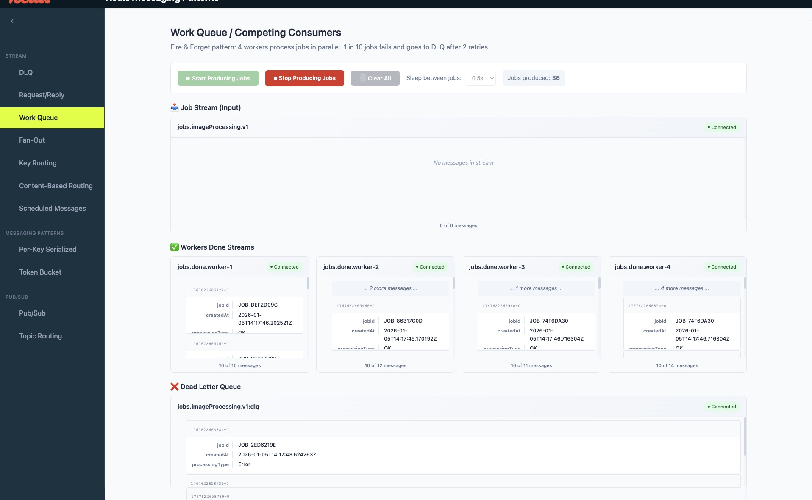
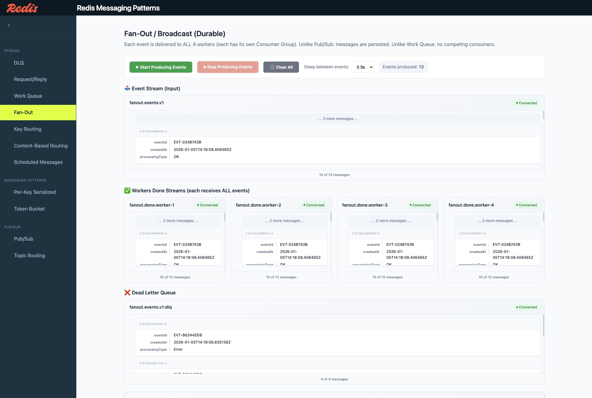
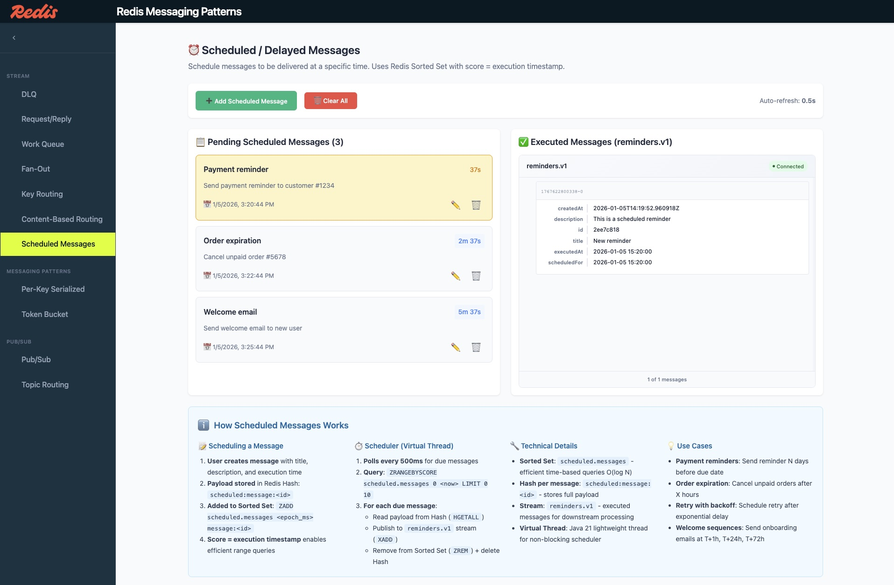
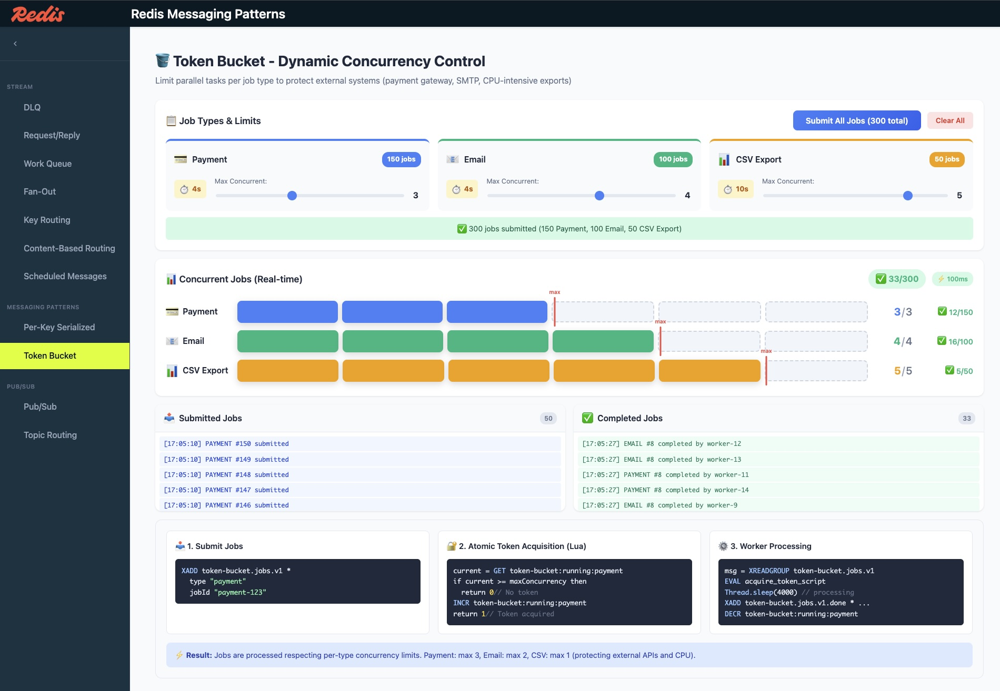
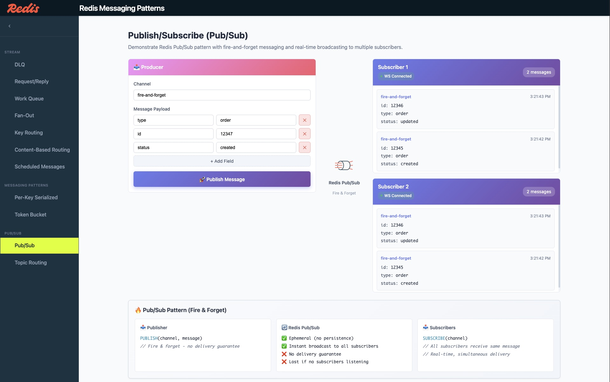
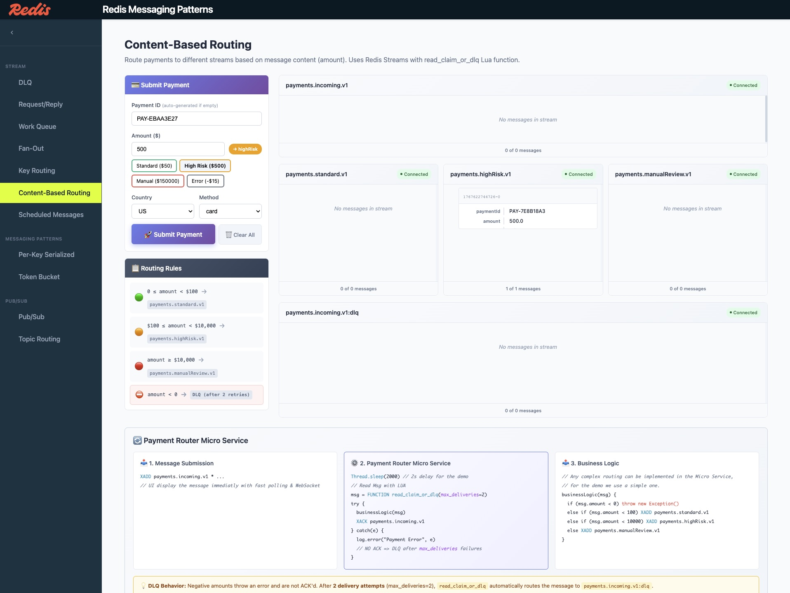
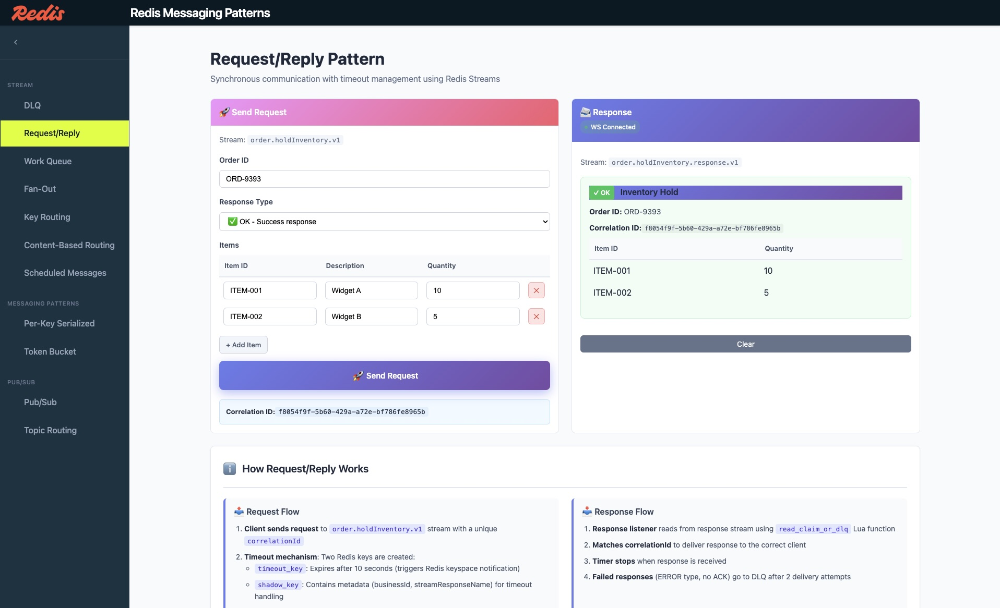
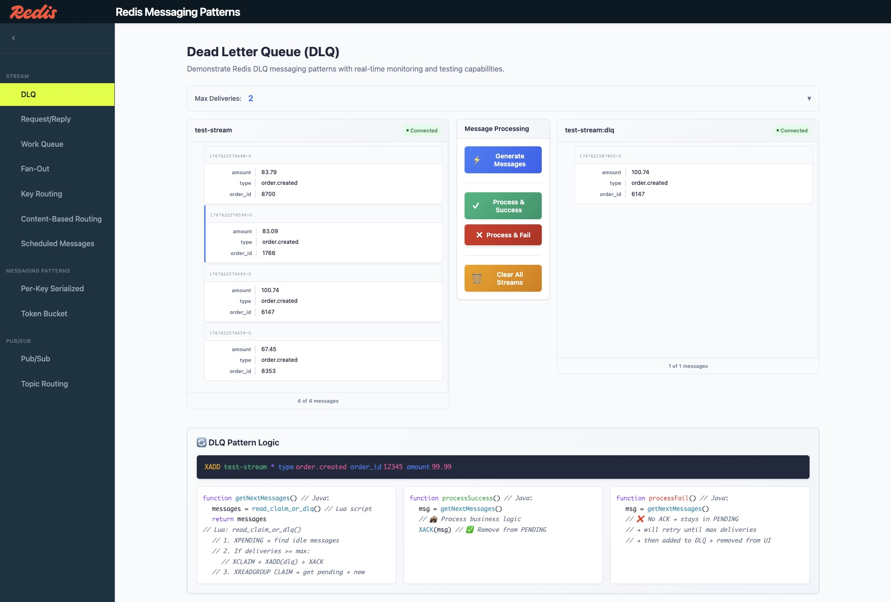

<div align="center">

# 🚀 Redis Messaging Patterns

**Learn enterprise messaging patterns using Redis Streams, Redis Functions, and Java 21 Virtual Threads**

[](./LICENSE)
[](https://openjdk.org/)
[](https://redis.io)
[](https://github.com/redis/jedis)
[](https://spring.io/projects/spring-boot)
[](https://angular.io)


[Patterns](#-implemented-patterns) • [Run the Project](#-run-the-project) • [Key Files](#-key-files-to-explore) • [Architecture](#-architecture)

</div>

---

## 📋 Table of Contents

- [What is This Project?](#-what-is-this-project)
- [Run the Project](#-run-the-project)
- [Screenshots](#️-screenshots)
- [Key Concepts](#-key-concepts-for-beginners)
- [Implemented Patterns](#-implemented-patterns)
- [Technology Stack](#-technology-stack)
- [Development Setup](#-development-setup)
- [Key Files to Explore](#-key-files-to-explore)
- [Architecture](#-architecture)
- [Contributing](#-contributing)
- [License](#-license)

---

## 🎯 What is This Project?

This project is a **learning resource** that demonstrates enterprise messaging patterns using Redis. It provides:

- **Working implementations** of messaging patterns 
    - DLQ
    - Pub/Sub
    - Request/Reply
- **Interactive web UI** to visualize and test each pattern in real-time
- **Demonstration code** with Redis Functions (Lua), Jedis, and Java 21 Virtual Threads

Whether you're new to messaging systems or Redis, this project helps you understand how to build reliable, scalable message-driven applications.

---

## 🚀 Run the Project

The easiest way to run the project is with **Docker Compose**. This starts all services (Redis, Backend, Frontend, Redis Insight) with a single command.

### Quick Start

```bash
# Clone the repository
git clone https://github.com/your-repo/redis-messaging-patterns.git
cd redis-messaging-patterns

# Start all services
./launch-docker.sh
```

### Access URLs

| Service | URL | Description |
|---------|-----|-------------|
| **Frontend** | http://localhost:4200 | Interactive web UI |
| **Backend API** | http://localhost:8080/api | REST API endpoints |
| **Redis Insight** | http://localhost:5540 | Redis GUI (add database: `redis:6379`) |
| **Redis** | localhost:6379 | Redis server |

### Docker Commands

```bash
# Start all services (build + logs)
./launch-docker.sh

# Stop all services
./stop-docker.sh

# Clean up (remove containers, images, volumes)
./clean-docker.sh
```

### Manual Docker Compose

```bash
# Start in background
docker compose up -d --build

# View logs
docker compose logs -f

# Stop services
docker compose down

# Stop and remove volumes
docker compose down -v
```

---

## 🖼️ Screenshots

### Stream Patterns

<table>
<tr>
<th>Work Queue</th>
<th>Fan-Out</th>
</tr>
<tr>
<td align="center"><a href="img/WorkQueue.jpg"></a></td>
<td align="center"><a href="img/Fan-Out.jpg"></a></td>
</tr>
<tr>
<td align="center">Distribute tasks across workers<br/>📊 <a href="docs/diagrams/work-queue.md">Architecture & Sequence Diagrams</a></td>
<td align="center">One message to multiple consumers<br/>📊 <a href="docs/diagrams/fan-out.md">Architecture & Sequence Diagrams</a></td>
</tr>
</table>

<table>
<tr>
<th>Per-Key Serialized Processing</th>
<th>Scheduled Messages</th>
</tr>
<tr>
<td align="center"><a href="img/Per-Key%20serialised%20Processing.jpg"></a></td>
<td align="center"><a href="img/ScheduledMessage.jpg"></a></td>
</tr>
<tr>
<td align="center">Process same-key messages in order<br/>📊 <a href="docs/diagrams/per-key-serialized.md">Architecture & Sequence Diagrams</a></td>
<td align="center">Delayed message delivery<br/>📊 <a href="docs/diagrams/scheduled-messages.md">Architecture & Sequence Diagrams</a></td>
</tr>
</table>

### Messaging Patterns

<table>
<tr>
<th>Token Bucket</th>
<th>Pub/Sub</th>
</tr>
<tr>
<td align="center"><a href="img/TokenBucket.jpg"></a></td>
<td align="center"><a href="img/PubSub.jpg"></a></td>
</tr>
<tr>
<td align="center">Dynamic concurrency control<br/>📊 <a href="docs/diagrams/token-bucket.md">Architecture & Sequence Diagrams</a></td>
<td align="center">Real-time broadcast messaging<br/>📊 <a href="docs/diagrams/pubsub.md">Architecture & Sequence Diagrams</a></td>
</tr>
</table>

### Routing Patterns

<table>
<tr>
<th>Content-Based Routing</th>
<th>Topic Routing</th>
</tr>
<tr>
<td align="center"><a href="img/content-based-routing.jpg"></a></td>
<td align="center"><a href="img/Topic%20Routing.jpg"></a></td>
</tr>
<tr>
<td align="center">Route by message content<br/>📊 <a href="docs/diagrams/content-based-routing.md">Architecture & Sequence Diagrams</a></td>
<td align="center">Route by topic hierarchy<br/>📊 <a href="docs/diagrams/topic-routing.md">Architecture & Sequence Diagrams</a></td>
</tr>
</table>

<table>
<tr>
<th>Key Routing</th>
<th>Request/Reply</th>
</tr>
<tr>
<td align="center"><a href="img/Key%20Routing.jpg"></a></td>
<td align="center"><a href="img/RequestReply.jpg"></a></td>
</tr>
<tr>
<td align="center">Route by key pattern<br/>📊 <a href="docs/diagrams/key-routing.md">Architecture & Sequence Diagrams</a></td>
<td align="center">Synchronous request-response<br/>📊 <a href="docs/diagrams/request-reply.md">Architecture & Sequence Diagrams</a></td>
</tr>
</table>

### Error Handling

<table>
<tr>
<th>Dead Letter Queue (DLQ)</th>
</tr>
<tr>
<td align="center"><a href="img/DLQ.jpg"></a></td>
</tr>
<tr>
<td align="center">Handle failed messages gracefully<br/>📊 <a href="docs/diagrams/dlq.md">Architecture & Sequence Diagrams</a></td>
</tr>
</table>

---

## 📚 Key Concepts for Beginners

### What is Messaging?

**Messaging** is a way for different parts of an application (or different applications) to communicate by sending and receiving messages through a message broker (like Redis).

```
┌──────────────┐     ┌────────────────┐     ┌──────────────┐
│   Producer   │ ──▶ │ Message Broker │ ──▶ │   Consumer   │
│ (sends msgs) │     │   (Redis)      │     │ (reads msgs) │
└──────────────┘     └────────────────┘     └──────────────┘
```

### What is Redis Streams?

**Redis Streams** is a data structure in Redis designed for **guaranteed messaging**. Think of it as an append-only log where:
- **Producers** add messages to the end of the stream
- **Consumers** poll the stream to read messages (pull model)
- **Consumer Groups** allow multiple consumers to share the workload
- **Messages are persisted** until explicitly deleted
- **Acknowledgment** ensures no message is lost

### What is Redis Pub/Sub?

**Redis Pub/Sub** is a **real-time push messaging** system where:
- **Publishers** send messages to channels
- **Subscribers** receive messages instantly via an **always-active connection**
- Messages are **not persisted** - if no subscriber is connected, the message is lost
- **No polling needed** - Redis pushes messages to subscribers automatically

**Streams vs Pub/Sub**:
| Feature | Redis Streams | Redis Pub/Sub |
|---------|--------------|---------------|
| Delivery model | Pull (polling) | Push (real-time) |
| Persistence | Yes | No |
| Guaranteed delivery | Yes | No |
| Connection | On-demand | Always active |
| Use case | Reliable queuing | Real-time notifications |

### What are Redis Functions?

**Redis Functions** allow you to run Lua scripts directly inside Redis. This ensures:
- **Atomicity**: Multiple operations execute as one
- **Performance**: No network round-trips for complex logic
- **Consistency**: Operations can't be interrupted

---

## ✨ Implemented Patterns

The app ships **11 messaging patterns**, each on its own page with a live data-flow view.
Detailed contracts (Redis keys, endpoints, edge cases) live in [`docs/specs/`](docs/specs/).

### 1. 📬 Dead Letter Queue (DLQ) — `/dlq`

**What it solves**: When message processing fails repeatedly, messages are automatically moved to a separate queue instead of being lost.

**Use case**: E-commerce order processing where some orders fail validation.

**Key concepts**: Consumer Groups track delivery count; after N failed attempts messages go to a `:dlq` stream; failed messages can be inspected and reprocessed. (Lua `read_claim_or_dlq`.)

### 2. 📢 Publish/Subscribe (Pub/Sub) — `/pubsub`

**What it solves**: Send a message to multiple recipients simultaneously without knowing who they are.

**Use case**: Real-time notifications, chat systems, live updates.

**Key concepts**: Fire-and-forget, no delivery guarantee, ephemeral (not persisted).

### 3. ↔️ Request/Reply — `/request-reply`

**What it solves**: Send a request and wait for a response, with automatic timeout handling. Multiple workers process requests in parallel without duplicates.

**Use case**: Inventory check before order confirmation, distributed task processing.

**Key concepts**: Correlation ID links request to response; Consumer Groups ensure exactly-once processing; expiring timeout keys + keyspace notifications trigger automatic TIMEOUT responses.

### 4. 👷 Work Queue (Competing Consumers) — `/work-queue`

**What it solves**: Spread jobs across parallel workers; each job handled by exactly one worker.

**Key concepts**: One consumer group, 4 Virtual-Thread workers; failed jobs retry then route to DLQ.

### 5. 📡 Fan-Out (Broadcast) — `/fan-out`

**What it solves**: Deliver **every** message to **every** worker (vs Work Queue's one-winner).

**Key concepts**: One consumer group **per worker** on the same stream; per-worker done streams.

### 6. 🧭 Topic Routing (Streams) — `/topic-routing`

**What it solves**: Route a message to one or more destination streams by a `routingKey`, using editable rules with priority and stop-on-match.

**Key concepts**: Lua `route_message`; rules stored in Redis hashes and editable at runtime.

### 7. 🧭 Topic Routing (Pub/Sub) — `/pubsub-topic-routing`

**What it solves**: Same routing idea over Redis Pub/Sub pattern subscriptions (`PSUBSCRIBE`).

**Key concepts**: Glob channel patterns (`order.eu.*`, `order.*.created`); non-durable, push-model.

### 8. 🔀 Content-Based Routing — `/content-routing`

**What it solves**: Route by **payload content** (payment amount) into tiered streams; invalid input → DLQ.

**Key concepts**: Threshold tiers (standard / high-risk / manual-review); routing metadata added.

### 9. ⏰ Scheduled / Delayed Messages — `/scheduled-messages`

**What it solves**: Deliver a message at a future time.

**Key concepts**: Sorted Set scored by due-time + payload Hash; scheduler polls and emits to `reminders.v1`.

### 10. 🔒 Per-Key Serialized Processing — `/per-key-serialized`

**What it solves**: Process jobs in parallel **across keys** but strictly serial **per key** (e.g. per `orderId`).

**Key concepts**: `SET NX` per-key lock; held keys skipped and retried via `XAUTOCLAIM`.

### 11. 🪣 Token Bucket (Concurrency Cap) — `/token-bucket`

**What it solves**: Cap concurrently-running jobs per type (e.g. Payment 3, Email 2, CSV 1).

**Key concepts**: Lua acquire-token check against per-type counters; live running/completed charts.

---

## 🛠 Technology Stack

| Technology | Purpose | Why We Use It |
|------------|---------|---------------|
| **Redis 8.4** | Message broker | In-memory speed, Streams support, Functions |
| **Redis Streams** | Message queuing | Persistence, consumer groups, delivery tracking |
| **Redis Functions** | Atomic operations | Run Lua scripts server-side for consistency |
| **Redis Pub/Sub** | Broadcast messaging | Real-time fan-out to multiple subscribers |
| **Jedis 7.1.0** | Redis client | Java library to interact with Redis |
| **Java 21** | Backend runtime | Virtual Threads for efficient I/O |
| **Spring Boot 3.5.7** | Web framework | REST API, WebSocket, dependency injection |
| **Angular 21** | Frontend | Real-time UI with WebSocket |
| **WebSocket** | Real-time comms | Push updates from server to browser |

---

## 🛠️ Development Setup

For development with hot-reload and debugging capabilities, run services separately.

### Prerequisites

| Tool | Version | Purpose |
|------|---------|---------|
| **Docker** | Latest | Run Redis container |
| **Java** | 21+ | Run Spring Boot backend |
| **Maven** | 3.8+ | Build Java project |
| **Node.js** | 18+ | Run Angular frontend |
| **npm** | 9+ | Install frontend dependencies |

### Step 1: Start Redis

```bash
# Start Redis 8.4 with Docker
docker run -d --name redis-messaging -p 6379:6379 redis:8.4-alpine

# Verify it's running
docker exec redis-messaging redis-cli PING
# Expected: PONG
```

### Step 2: Start the Backend

```bash
# Build and run
mvn clean package -DskipTests
java -jar target/redis-messaging-patterns-1.0.0.jar

# Or with Maven directly (hot-reload with spring-boot-devtools)
mvn spring-boot:run
```

Backend runs on **http://localhost:8080**

> **Note**: Lua functions are automatically loaded into Redis on Spring Boot startup via [`RedisLuaFunctionLoader.java`](src/main/java/com/redis/patterns/service/RedisLuaFunctionLoader.java). No manual loading required.

### Step 3: Start the Frontend

```bash
cd frontend
npm install
npm start
```

Frontend runs on **http://localhost:4200** with hot-reload enabled.

---

## 📂 Key Files to Explore

This section highlights the most important files for understanding each pattern.

### 🔧 Lua Functions (Server-Side Logic)

| File | Description |
|------|-------------|
| **[`lua/stream_utils.lua`](lua/stream_utils.lua)** | **All Redis Functions in one file**: `read_claim_or_dlq`, `request`, `response` |

**What to look for**:
- `read_claim_or_dlq` (line 59): Uses Redis 8.4's `XREADGROUP CLAIM` for atomic claim+read
- `request` (line 188): Creates timeout tracking keys with `SET EX` and posts to stream
- `response` (line 279): Deletes timeout key and posts response

### ☕ Java Services (Backend Logic)

#### DLQ Pattern

| File | Key Concepts |
|------|--------------|
| **[`DLQMessagingService.java`](src/main/java/com/redis/patterns/service/DLQMessagingService.java)** | Jedis `fcall()` to invoke Lua functions, `XADD`, `XREADGROUP`, `XACK` |
| **[`RedisStreamListenerService.java`](src/main/java/com/redis/patterns/service/RedisStreamListenerService.java)** | **Virtual Threads** + `XREAD BLOCK` for real-time stream monitoring |

#### Pub/Sub Pattern

| File | Key Concepts |
|------|--------------|
| **[`PubSubService.java`](src/main/java/com/redis/patterns/service/PubSubService.java)** | Jedis `publish()` for fire-and-forget messaging |
| **[`RedisPubSubListener.java`](src/main/java/com/redis/patterns/config/RedisPubSubListener.java)** | Jedis `JedisPubSub` for subscribing to channels |

#### Request/Reply Pattern

| File | Key Concepts |
|------|--------------|
| **[`RequestReplyService.java`](src/main/java/com/redis/patterns/service/RequestReplyService.java)** | Full pattern: request, response, timeout handling with Virtual Threads |
| **[`KeyspaceNotificationConfig.java`](src/main/java/com/redis/patterns/config/KeyspaceNotificationConfig.java)** | Redis keyspace notifications for timeout detection |

### 🌐 WebSocket (Real-Time Communication)

| File | Description |
|------|-------------|
| **[`WebSocketEventService.java`](src/main/java/com/redis/patterns/service/WebSocketEventService.java)** | Broadcasts events to all connected Angular clients |
| **[`websocket.service.ts`](frontend/src/app/services/websocket.service.ts)** | SockJS client with automatic reconnection |

---

## 🏗️ Architecture

### How Virtual Threads Monitor Streams

```
┌─────────────────────────────────────────────────────────────────────┐
│                     Spring Boot Application                         │
├─────────────────────────────────────────────────────────────────────┤
│                                                                     │
│  ┌──────────────────────┐    ┌──────────────────────┐               │
│  │  Virtual Thread #1   │    │  Virtual Thread #2   │               │
│  │  (stream-listener-   │    │  (request-listener)  │               │
│  │   test-stream)       │    │                      │               │
│  └──────────┬───────────┘    └──────────┬───────────┘               │
│             │                            │                          │
│             │ XREAD BLOCK 1000           │ XREADGROUP BLOCK 5000    │
│             │                            │                          │
│             ▼                            ▼                          │
│  ┌──────────────────────────────────────────────────────┐           │
│  │                 JedisPool (Connection Pool)          │           │
│  └────────────────────────-──┬──────────────────────────┘           │
│                              │                                      │
└──────────────────────────────┼──────────────────────────────────────┘
                               │
                               ▼
                    ┌────────────────────-─┐
                    │        Redis         │
                    │   (Streams, Pub/Sub) │
                    └────────────────────-─┘
```

**Why Virtual Threads?**
- Lightweight: Millions of threads possible
- Blocking I/O is efficient (no thread pool exhaustion)
- Perfect for `XREAD BLOCK` and `XREADGROUP BLOCK`

### WebSocket Event Flow

```
┌─────────────────┐     ┌─────────────────┐     ┌─────────────────┐
│  Redis Stream   │     │  Spring Boot    │     │  Angular App    │
│                 │     │                 │     │                 │
│  test-stream    │────▶│ XREAD BLOCK     │────▶│ WebSocket       │
│  test-stream:dlq│     │                 │     │ Service         │
└─────────────────┘     │ ──────────────  │     │ ─────────────   │
                        │ WebSocket       │     │ Updates UI      │
                        │ EventService    │     │                 │
                        └─────────────────┘     └─────────────────┘
```

---

## 📚 Redis Functions Reference

### `read_claim_or_dlq` (DLQ Pattern)

Claims pending messages and routes failed ones to DLQ.

```bash
FCALL read_claim_or_dlq 2 <stream> <dlq> <group> <consumer> <minIdle> <count> <maxDeliver>
```

**Example**:
```bash
redis-cli FCALL read_claim_or_dlq 2 orders orders:dlq order-group worker1 5000 100 3
```

### `request` (Request/Reply Pattern)

Sends a request with automatic timeout tracking.

```bash
FCALL request 3 <timeout_key> <shadow_key> <stream> <correlationId> <businessId> <responseStream> <timeout> <payloadJson>
```

### `response` (Request/Reply Pattern)

Sends a response and cancels the timeout.

```bash
FCALL response 2 <timeout_key> <stream> <correlationId> <businessId> <payloadJson>
```

---

## 📁 Project Structure

```
RedisMessagingPatternsWithJedis/
├── lua/
│   └── stream_utils.lua              # All Lua functions (DLQ + Request/Reply)
│
├── src/main/java/com/redis/patterns/
│   ├── service/
│   │   ├── DLQMessagingService.java       # DLQ operations with Jedis
│   │   ├── PubSubService.java             # Pub/Sub publish
│   │   ├── RequestReplyService.java       # Request/Reply with Virtual Threads
│   │   ├── RedisStreamListenerService.java # XREAD BLOCK with Virtual Threads
│   │   └── WebSocketEventService.java     # Broadcast to Angular
│   ├── config/
│   │   ├── RedisConfig.java               # JedisPool configuration
│   │   ├── RedisPubSubConfig.java         # Pub/Sub subscriber setup
│   │   └── KeyspaceNotificationConfig.java # Timeout detection
│   └── controller/
│       ├── DLQController.java             # REST API for DLQ
│       ├── PubSubController.java          # REST API for Pub/Sub
│       └── RequestReplyController.java    # REST API for Request/Reply
│
├── frontend/src/app/
│   ├── components/
│   │   ├── dlq/                           # DLQ demo page
│   │   ├── pubsub/                        # Pub/Sub demo page
│   │   ├── request-reply/                 # Request/Reply demo page
│   │   └── stream-viewer/                 # Reusable stream viewer
│   └── services/
│       ├── websocket.service.ts           # WebSocket client
│       └── redis-api.service.ts           # HTTP client
│
└── README.md                              # You are here!
```

---

## 📖 Documentation

- **Humans** start here (this README): how to run, patterns overview, screenshots.
- **Agents / deep dives** live in [`docs/`](docs/):
  - [`docs/product/PRD.md`](docs/product/PRD.md) — problem, users, scope
  - [`docs/architecture/overview.md`](docs/architecture/overview.md) — system design, thread model, Redis keys
  - [`docs/specs/`](docs/specs/) — one contract per pattern (11)
  - [`docs/adr/`](docs/adr/) — key decisions and why
  - [`docs/migration-status.md`](docs/migration-status.md) — what's done vs. roadmap
  - [`docs/TODO.md`](docs/TODO.md) — open review/security/quality findings
- [`CLAUDE.md`](CLAUDE.md) is the entry map for AI assistants.

> ⚠️ This is an **educational demo** — no auth, open CORS, demo-grade security. Not for production
> exposure. See [`docs/adr/0008-demo-grade-security-posture.md`](docs/adr/0008-demo-grade-security-posture.md).

---

## 🤝 Contributing

Contributions are welcome! Please:

1. Fork the repository
2. Create a feature branch
3. Submit a Pull Request

---

## 📄 License

**GNU Lesser General Public License v2.1** - See [LICENSE](./LICENSE)

---

<div align="center">

**[⬆ Back to Top](#-redis-messaging-patterns)**

Made with ❤️ for the Redis community

</div>

