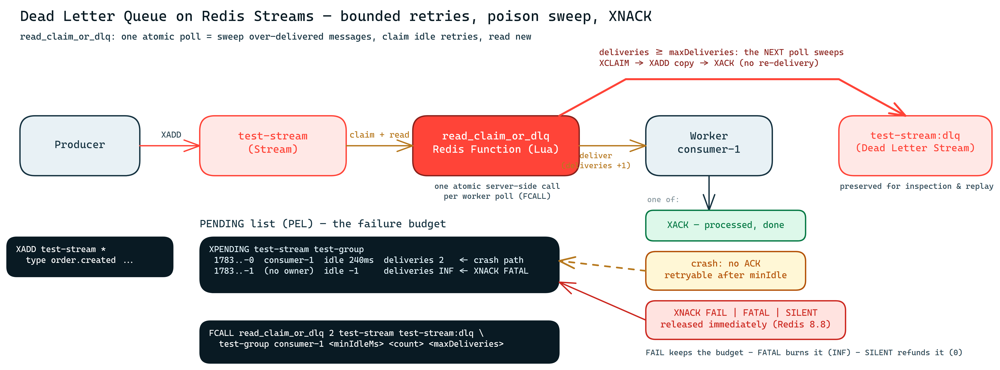

# Dead Letter Queues on Redis Streams — bounded retries, poison messages, and the new XNACK

<!-- Section 1 — series intro: TODO (task 9) -->

<!-- Section 2 — the problem: TODO (task 9) -->

<!-- Section 3 — the pattern + diagram: TODO (task 9) -->


<!-- Section 4 — pseudo-code: TODO (task 9) -->

<!-- Section 5 — Redis Functions sidebar: TODO (task 9) -->

## Reproduce it in 5 minutes

Everything below runs against a vanilla **Redis 8.8+** with nothing but `redis-cli` — no
application code involved. Start a throwaway server and grab the demo repository (we only need one
Lua file from it):

```bash
docker run -d --name dlq-demo -p 6379:6379 redis:8.8-alpine
git clone https://github.com/dev-mansonthomas/RedisMessagingPatternsWithJedis.git
cd RedisMessagingPatternsWithJedis
```

Load the functions library and create the consumer group (or run
[`samples/setup.sh`](https://github.com/dev-mansonthomas/RedisMessagingPatternsWithJedis/blob/blog-dlq-v1/blog/dlq-redis-streams/samples/setup.sh),
which does exactly this):

<!-- verify:begin -->
```bash
./blog/dlq-redis-streams/samples/setup.sh
```

Produce a well-behaved message and a poison message, then poll with the function. Both come back
for processing — first delivery, `deliveries = 1`:

```bash
GOOD=$(redis-cli XADD test-stream '*' type order.created order_id 1001 amount 49.90)
POISON=$(redis-cli XADD test-stream '*' type order.poison order_id 666 amount 0.00)

redis-cli FCALL read_claim_or_dlq 2 test-stream test-stream:dlq test-group consumer-1 100 100 2
```

Ack the good one; for the poison one, do what a crashed worker does — nothing:

```bash
redis-cli XACK test-stream test-group "$GOOD"
```

Now wait past `minIdle` (100 ms here) and poll again. The poison message is re-delivered —
`deliveries` climbs to 2, which is our `maxDeliveries` budget:

```bash
sleep 0.3
redis-cli FCALL read_claim_or_dlq 2 test-stream test-stream:dlq test-group consumer-1 100 100 2
redis-cli XPENDING test-stream test-group
# → 1 pending entry, delivery count: 2
```

One more idle period, one more poll — and this is the sweep: the function returns **no message to
process**, just the pair `[original_id, dlq_id]`. The poison message now lives in the DLQ stream,
and the pending list is clean:

```bash
sleep 0.3
redis-cli FCALL read_claim_or_dlq 2 test-stream test-stream:dlq test-group consumer-1 100 100 2
redis-cli XRANGE test-stream:dlq - +
redis-cli XPENDING test-stream test-group
# → total pending: 0
```

Note the timing: the message was **delivered `maxDeliveries` (2) times, and the *next* poll swept
it**. The DLQ check runs before the re-read, so it only sees delivery counts from previous calls —
`maxDeliveries + 1` polls in total, each at least `minIdle` apart.
<!-- verify:end -->

## Explicit failure with XNACK (Redis 8.8)

<!-- Section 7 prose intro: TODO (task 9) -->

<!-- verify:begin -->
```bash
MSG=$(redis-cli XADD test-stream '*' type order.created order_id 2002 amount 12.50)
redis-cli FCALL read_claim_or_dlq 2 test-stream test-stream:dlq test-group consumer-1 100 100 2

# "I tried and failed" — release it NOW, keep the failure on the books:
redis-cli XNACK test-stream test-group FAIL IDS 1 "$MSG"
redis-cli XPENDING test-stream test-group - + 10
# → entry has NO consumer, idle = -1, deliveries kept at 1
```

No `sleep` this time — a released message is immediately re-claimable:

```bash
redis-cli FCALL read_claim_or_dlq 2 test-stream test-stream:dlq test-group consumer-1 100 100 2
# → re-delivered instantly (deliveries: 2)
```

Or skip the retries entirely. `FATAL` burns the whole failure budget (the counter jumps to the
maximum), so the very next poll sweeps the message to the DLQ — again with no waiting:

```bash
redis-cli XNACK test-stream test-group FATAL IDS 1 "$MSG"
redis-cli FCALL read_claim_or_dlq 2 test-stream test-stream:dlq test-group consumer-1 100 100 2
redis-cli XRANGE test-stream:dlq - +
# → two entries now: the timeout-swept poison + this one
```

Finally `SILENT`, for the consumer that must give work back *without* having tried — a graceful
shutdown, for instance. The delivery counter is reset to 0: the failure budget is refunded:

```bash
MSG2=$(redis-cli XADD test-stream '*' type order.created order_id 3003 amount 5.00)
redis-cli FCALL read_claim_or_dlq 2 test-stream test-stream:dlq test-group consumer-1 100 100 2
redis-cli XNACK test-stream test-group SILENT IDS 1 "$MSG2"
redis-cli XPENDING test-stream test-group - + 10
# → deliveries: 0 — as if the delivery never happened

redis-cli FCALL read_claim_or_dlq 2 test-stream test-stream:dlq test-group consumer-1 100 100 2
redis-cli XACK test-stream test-group "$MSG2"
```
<!-- verify:end -->

<!-- Section 8 — call it from your language: TODO (task 9, links to samples/) -->

<!-- forbidden-exempt:begin -->
<!-- Section 9 — see it live: TODO (task 9) -->
<!-- forbidden-exempt:end -->
