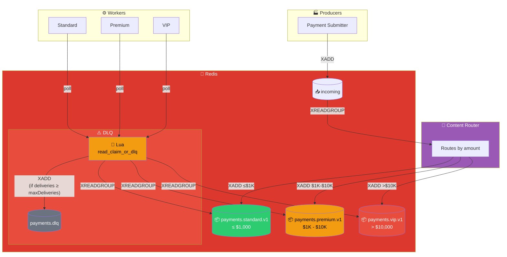
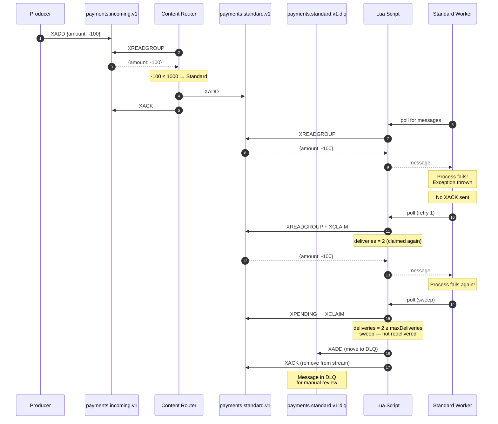

# Content-Based Routing Pattern

## Architecture Diagram

## Sequence Diagram

## Routing Rules

| Amount Range | Target Stream | Priority |
|-------------|---------------|----------|
| ≤ $1,000 | payments.standard.v1 | Normal |
| $1,001 - $10,000 | payments.premium.v1 | High |
| > $10,000 | payments.vip.v1 | Critical |
| Negative (after 2 retries) | payments.standard.v1:dlq | DLQ |

## Key Points

- **Content Router**: Microservice that reads from incoming stream and routes to target streams based on amount
- **Lua Script**: Executes inside Redis, handles XREADGROUP + XCLAIM + DLQ logic atomically
- **Workers poll Lua**: Workers call the Lua script periodically to fetch pending messages
- **DLQ Flow**: When a message fails processing 2+ times, Lua moves it to DLQ automatically
- **No direct DLQ routing**: Router never sends to DLQ - only Lua does after repeated failures
