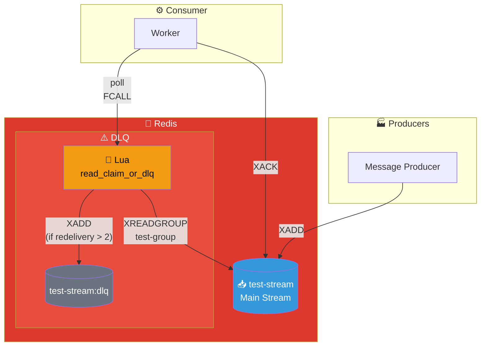
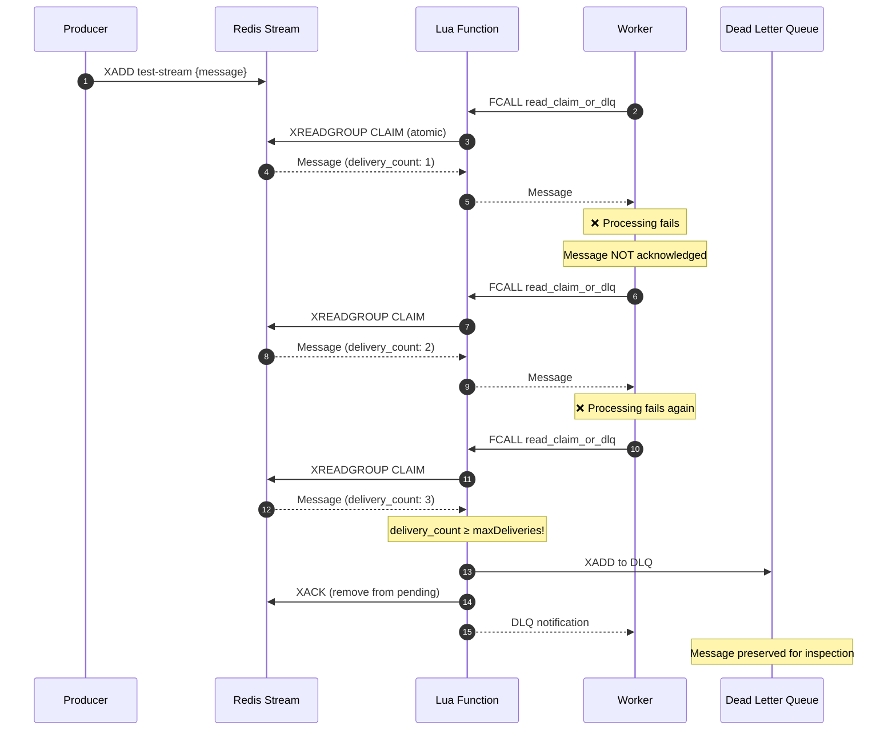

# Dead Letter Queue (DLQ) Pattern

## Architecture Diagram

## Sequence Diagram

## Key Points

- **Automatic Retry**: Failed messages automatically re-delivered
- **Delivery Counter**: Redis tracks how many times a message was delivered
- **Max Deliveries**: After N failures, message goes to DLQ
- **Atomic Operation**: Lua function ensures claim+read is atomic
- **Inspection**: DLQ messages can be inspected and manually reprocessed

