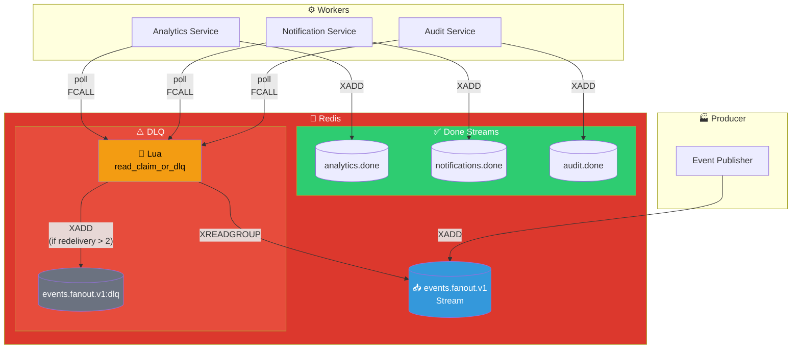
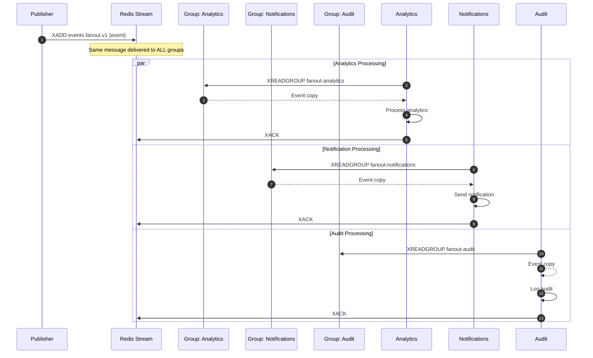

# Fan-Out Pattern

## Architecture Diagram

## Sequence Diagram

## Key Points

- **Multiple Consumer Groups**: Each group gets ALL messages independently
- **Independent Processing**: Each service processes at its own pace
- **Guaranteed Delivery**: Each group tracks its own position in the stream
- **Use Case**: Event broadcasting to multiple downstream services
- **Difference from Pub/Sub**: Messages are persisted and guaranteed

