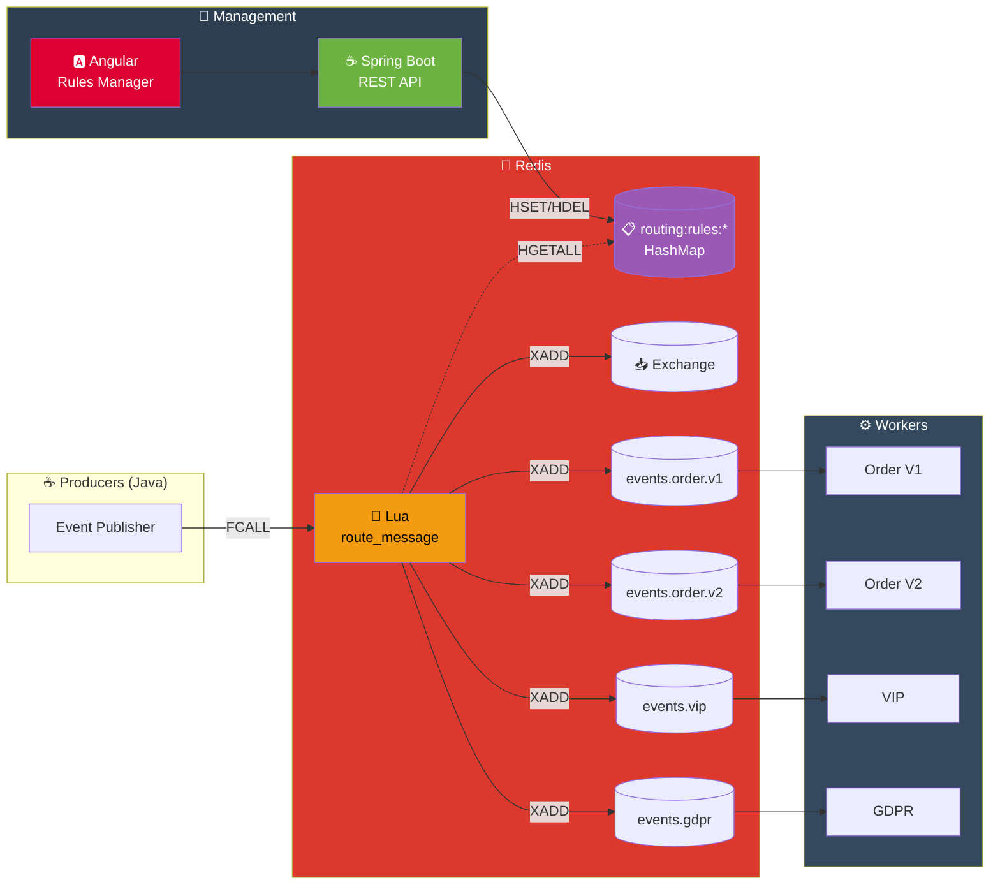
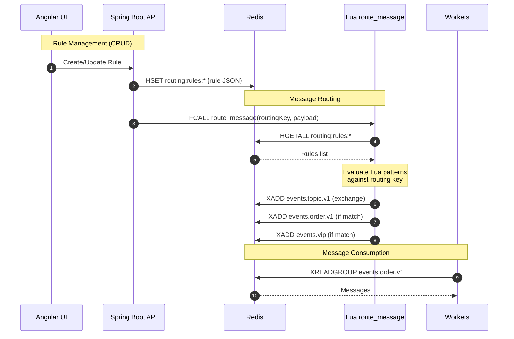

# Key Routing Pattern

## Architecture Diagram

## Sequence Diagram

## Routing Rules Example

| Pattern | Destination | Priority | Stop on Match |
|---------|-------------|----------|---------------|
| `^order%.place%..*%.v1$` | events.order.v1 | 10 | false |
| `^order%.place%..*%.v2$` | events.order.v2 | 10 | false |
| `^order%..*%.vip%.` | events.vip | 20 | false |
| `^order%..*%.eu%.` | events.gdpr | 30 | false |
| `^order%.cancelled%.` | events.audit | 5 | true |

## Key Points

- **Dynamic Routing Rules**: Rules stored in Redis HashMap, no redeploy needed
- **Lua Pattern Matching**: More expressive than RabbitMQ's * and #
- **CRUD via REST API**: Angular UI manages rules through Spring Boot API
- **Multi-destination**: One message can route to multiple streams
- **Stop on Match**: Rules can stop evaluation after matching
- **Priority-based**: Lower priority number = evaluated first
- **Audit Trail**: All messages logged to exchange stream

