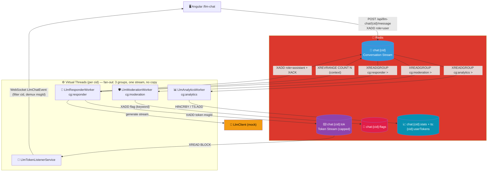
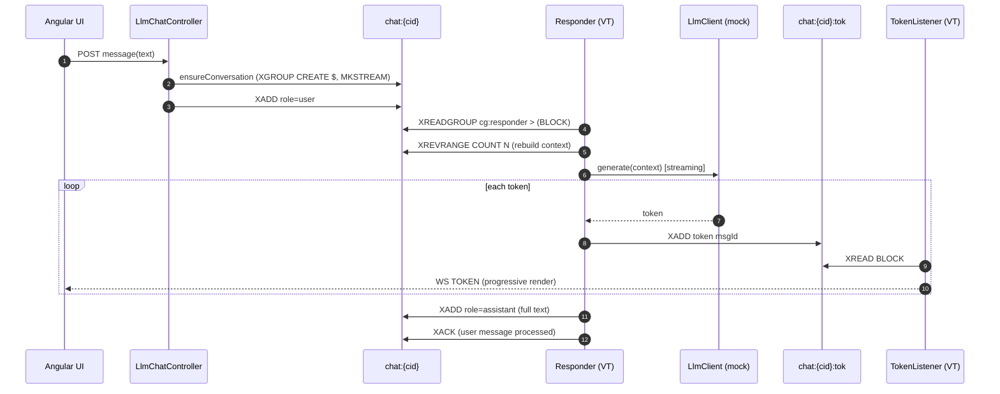
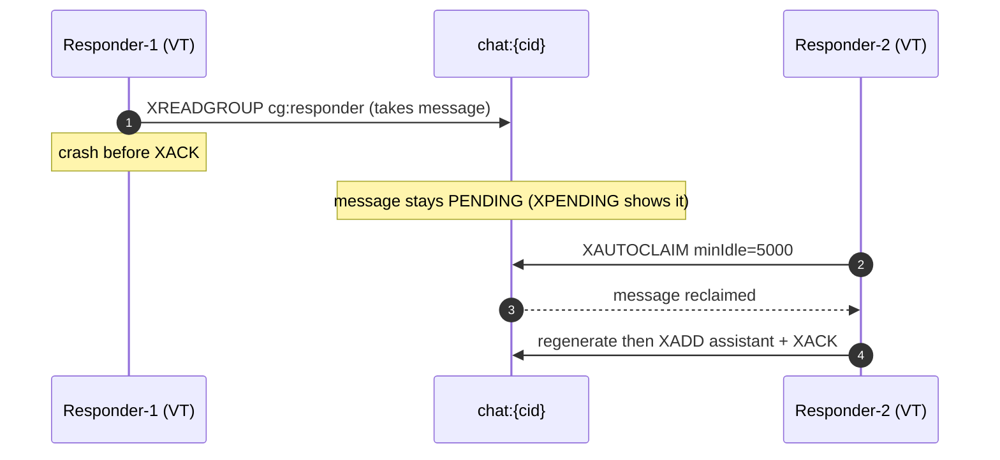

# LLM Chat Pattern (#12)

> Slices 1 (happy path + internals), 2 (fan-out) and 3 (resilience: XAUTOCLAIM recovery + DLQ) are
> all implemented. See `docs/specs/llm-chat.md`. (The frontend renders the same diagram, with the
> recovery sweeper + DLQ nodes.)

## Architecture Diagram

## Sequence Diagram — happy path

## Sequence Diagram — crash recovery (Slice 3)

## Key Points

- **The conversation is the stream**: `chat:{cid}` is the ordered, replayable source of truth.
- **Context via `XREVRANGE`**: the last N turns are read back to seed the model.
- **Token streaming is a stream**: `chat:{cid}:tok` (one per conversation, `msgId`-tagged) feeds the
  live UI; a single listener per `cid`, front demuxes by `msgId`.
- **Group before `XADD`, at `$`**: no missed messages; `role != user → XACK & skip` prevents an
  infinite generate loop.
- **Display reads are `XRANGE`/`XINFO`** — never `XREADGROUP` — to avoid phantom pending entries.
