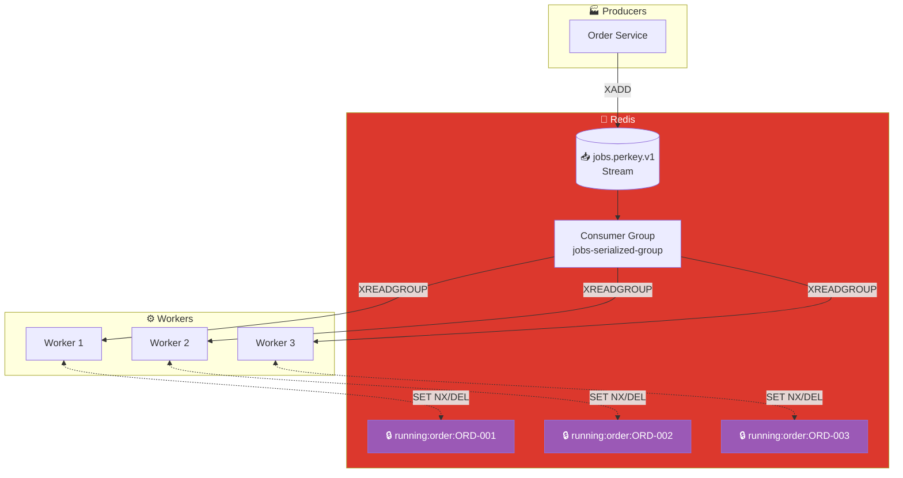
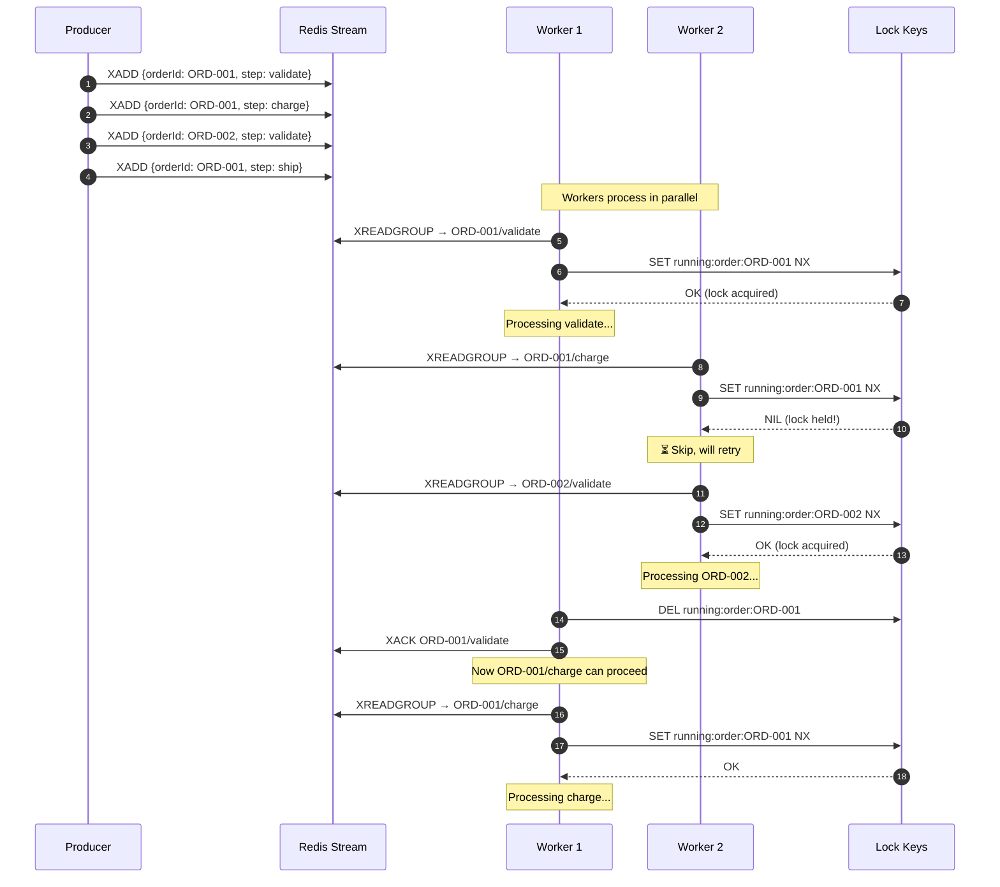

# Per-Key Serialized Processing Pattern

## Architecture Diagram

## Sequence Diagram

## Key Points

- **Per-Key Ordering**: Messages for the same key processed sequentially
- **Parallel Different Keys**: Different order IDs process in parallel
- **Distributed Lock**: `SET NX` ensures only one worker per key
- **Lock TTL**: Locks have expiration to prevent deadlocks
- **Use Case**: Order processing where steps must execute in order

