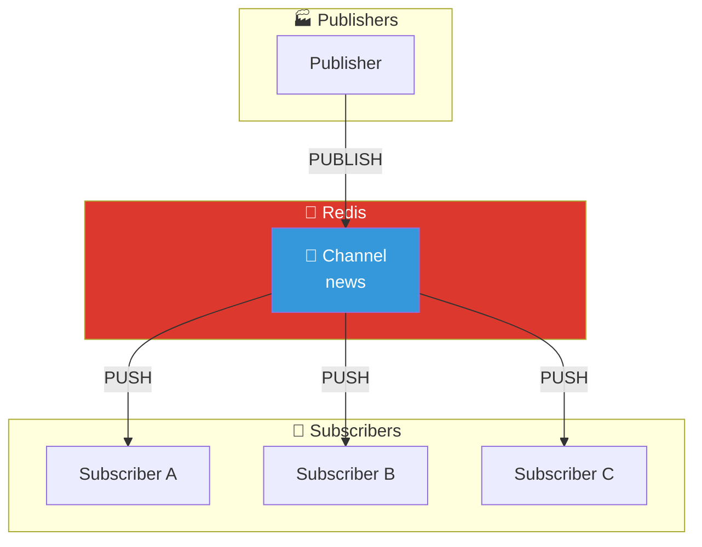
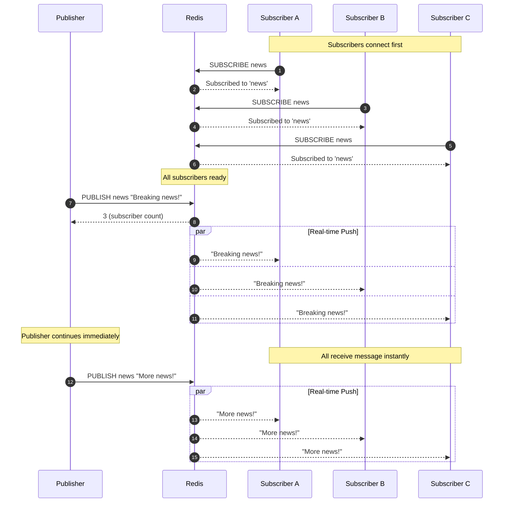

# Pub/Sub Pattern

## Architecture Diagram

## Sequence Diagram

## Key Points

- **Fire-and-Forget**: Publisher doesn't wait for delivery confirmation
- **Real-time Push**: Messages pushed instantly (no polling)
- **No Persistence**: Messages not stored - must be connected to receive
- **Fan-Out**: One message reaches all subscribers
- **Use Case**: Chat, notifications, live updates
- **Difference from Streams**: No history, no guaranteed delivery

