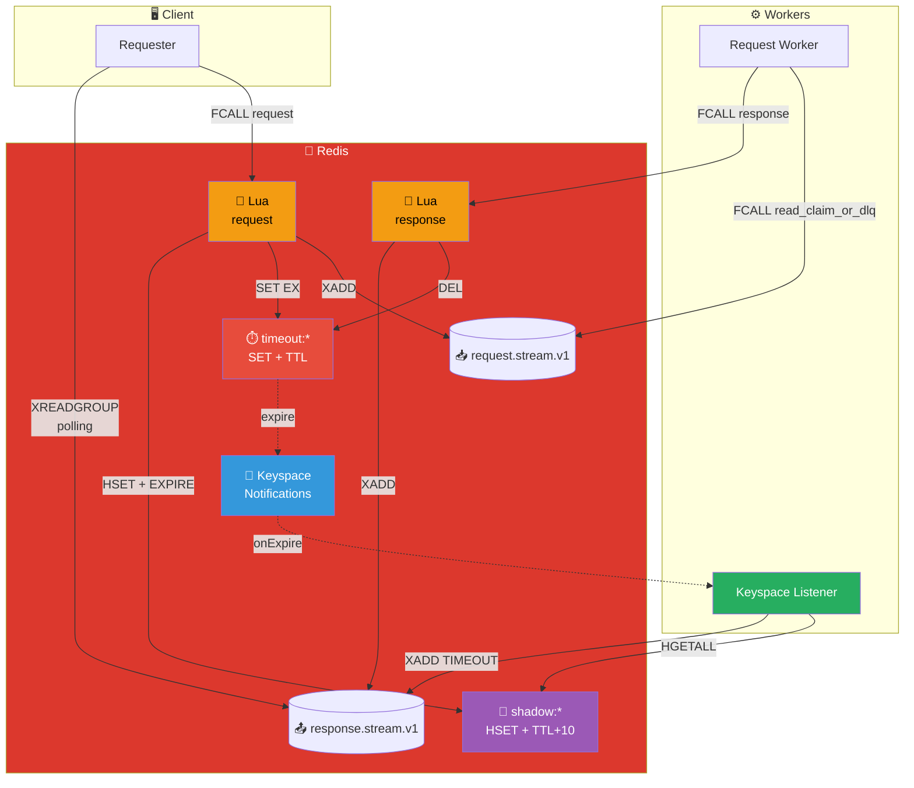
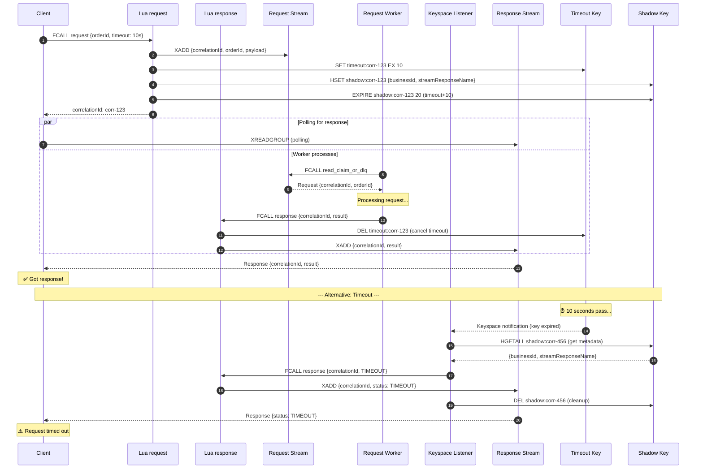

# Request/Reply Pattern

## Architecture Diagram

## Sequence Diagram

## Key Points

- **Correlation ID**: Links request to its response
- **Timeout Handling**: TTL keys trigger automatic timeout response via Keyspace Listener
- **Shadow Key**: Stores metadata (businessId, streamResponseName) for timeout handling
- **Atomic Operations**: Lua ensures request setup is atomic
- **Two Lua Functions**: `request` (sends request + sets up timeout) and `response` (sends response + cancels timeout)
- **Keyspace Listener**: Java worker that consumes Redis key expiration events and publishes TIMEOUT responses

