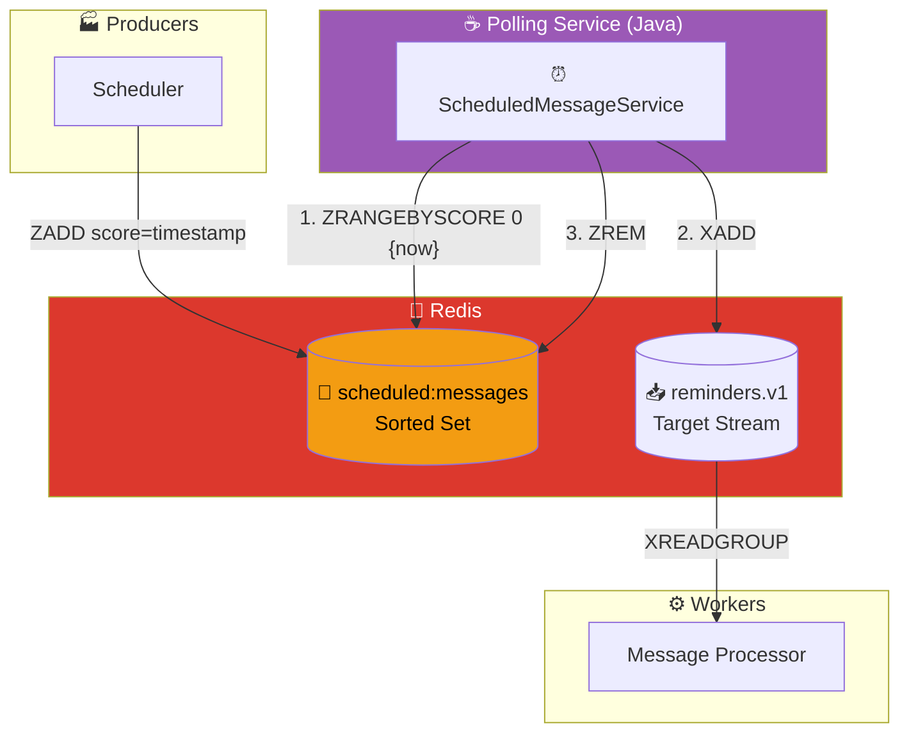
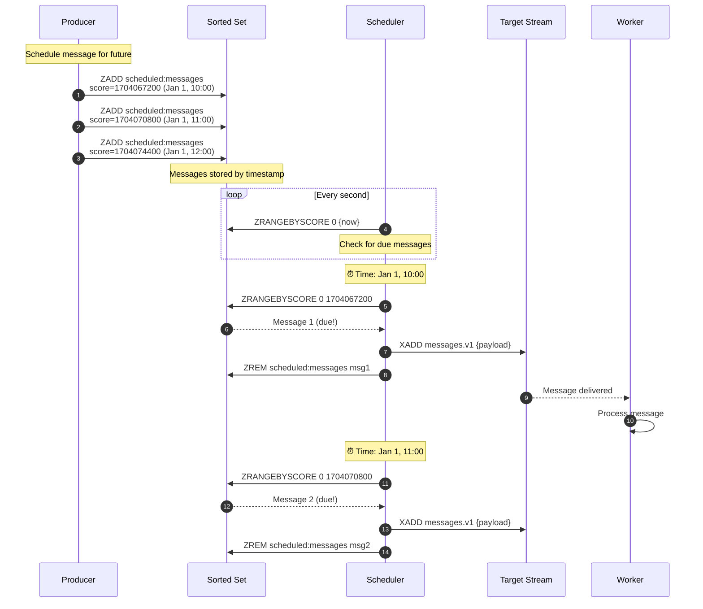

# Scheduled Messages Pattern

## Architecture Diagram

## Sequence Diagram

## How It Works

| Step | Redis Command | Description |
|------|---------------|-------------|
| 1. Schedule | `ZADD key score payload` | Store message with timestamp as score |
| 2. Poll | `ZRANGEBYSCORE key 0 {now}` | Find messages due now |
| 3. Deliver | `XADD stream payload` | Add to target stream |
| 4. Remove | `ZREM key payload` | Remove from scheduled set |

## Key Points

- **Sorted Set Score**: Unix timestamp determines delivery time
- **Polling**: Service checks every second for due messages
- **Atomic Move**: Message removed from schedule after delivery
- **Persistence**: Scheduled messages survive Redis restart
- **Use Case**: Reminders, delayed notifications, scheduled jobs

