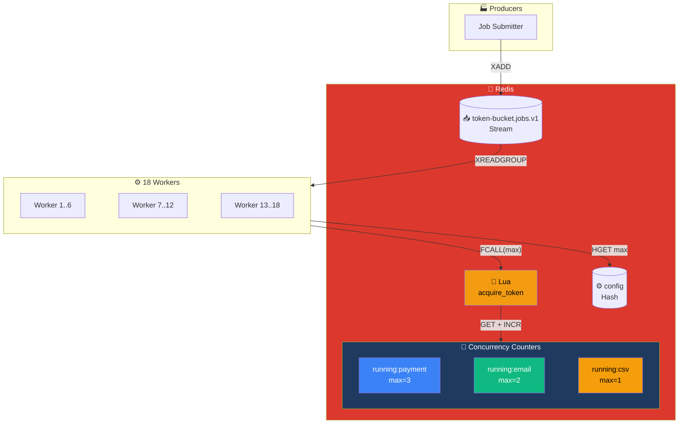
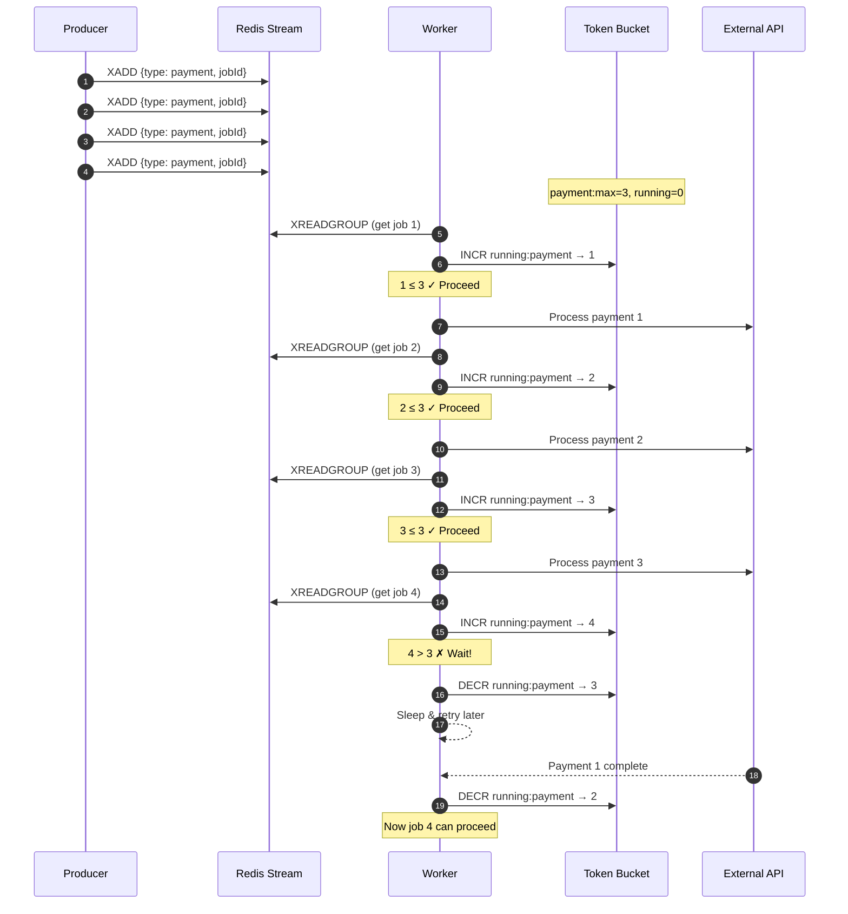

# Token Bucket Pattern

## Architecture Diagram

## Sequence Diagram

## Key Points

- **Concurrency Limit**: Each job type has a configurable max concurrency
- **Dynamic Configuration**: Limits can be changed at runtime via Redis Hash
- **Global Coordination**: All workers share the same counters
- **Use Case**: Protect external APIs from overload
- **Job Types**: payment (max 3), email (max 2), csv (max 1)

