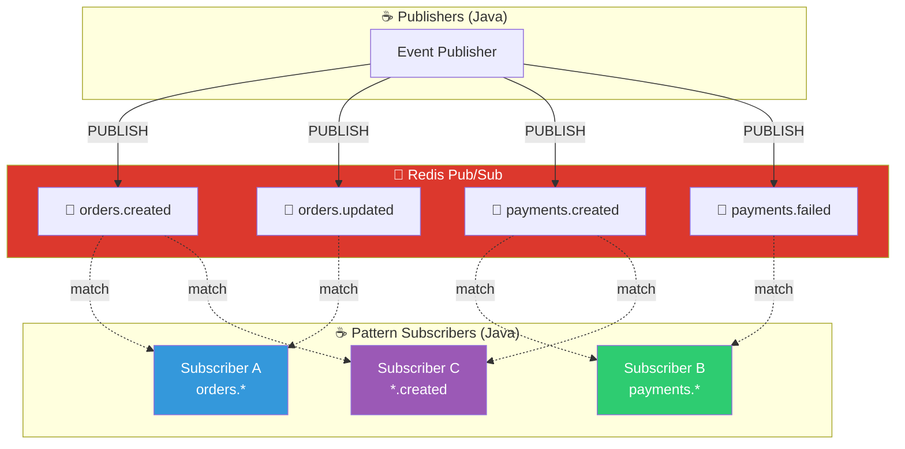
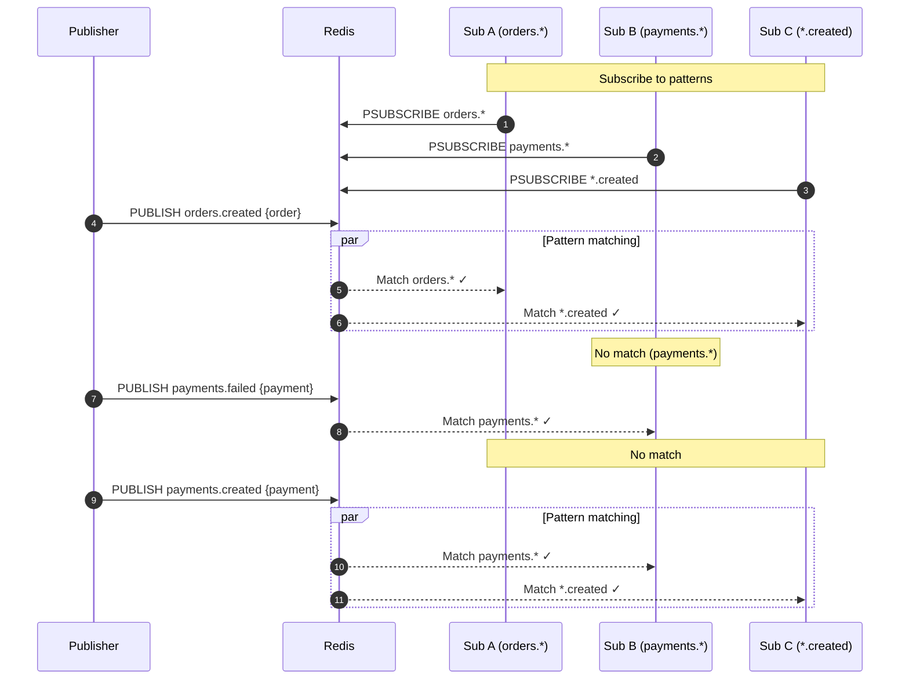

# Topic Routing Pattern (Pub/Sub with Pattern Matching)

## Architecture Diagram

## Sequence Diagram

## Pattern Examples

| Pattern | Matches | Doesn't Match |
|---------|---------|---------------|
| `orders.*` | orders.created, orders.updated | payments.created |
| `*.created` | orders.created, payments.created | orders.updated |
| `payments.*` | payments.created, payments.failed | orders.created |
| `*.*` | All two-level topics | single-level |

## Key Points

- **Pattern Matching**: PSUBSCRIBE allows wildcard patterns
- **Flexible Routing**: Subscribers choose what to receive
- **Decoupled**: Publishers don't know subscribers
- **Real-time**: Instant push delivery
- **Use Case**: Event-driven architectures, microservices

