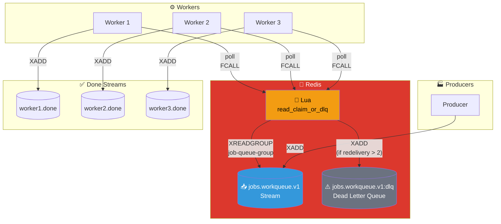
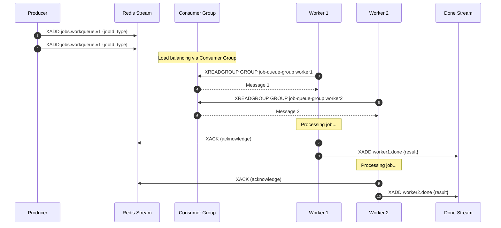

# Work Queue Pattern

## Architecture Diagram

## Sequence Diagram

## Key Points

- **Load Balancing**: Consumer Group distributes messages across workers
- **Exactly-Once Delivery**: Each message delivered to only one worker
- **Acknowledgment**: Workers ACK after successful processing
- **DLQ Support**: Failed messages (after max retries) go to Dead Letter Queue
- **Visibility**: Each worker has its own "done" stream for tracking

