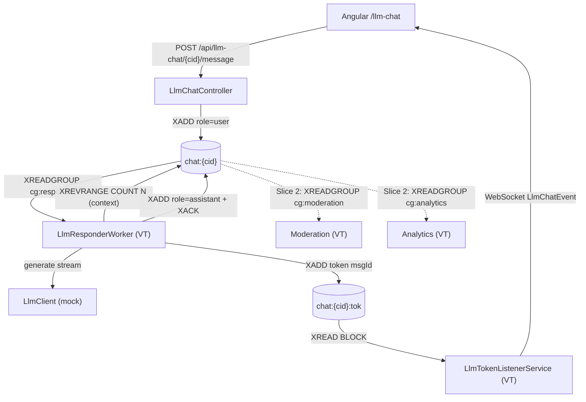
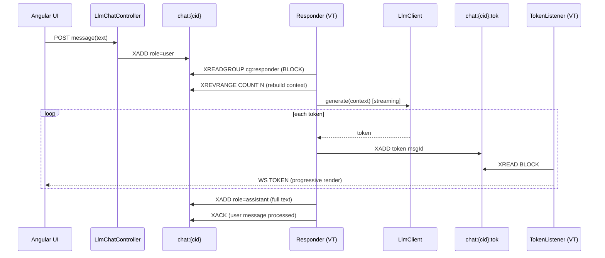
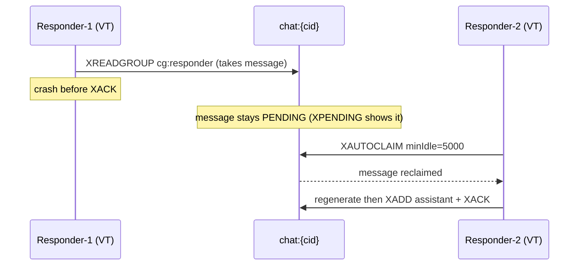

# Spec — LLM Chat with Redis Streams (Pattern #12)

Route `/llm-chat` · `LlmChatController` (`/api/llm-chat`) · `LlmChatService` ·
`LlmResponderWorker` · `LlmTokenListenerService` · `llm/LlmClient` (+ `MockLlmClient`) ·
`LlmChatConfig`.

> **Implemented: Slices 1–3 (happy path + internals, fan-out, resilience) plus a reply-timeout via
> keyspace notifications, a RedisTimeSeries analytics chart, and pending-state visualization** (see
> *Post-slice-3 additions*). Only `OllamaLlmClient` remains **out of scope** (§ Roadmap).
> Source: merged from `docs/product/brief.md` and the former `docs/llm-chat-streams-spec.md`
> (brainstorm), which this file supersedes.

---

## Purpose

Demonstrate why **Redis Streams** is the right substrate for an LLM conversation: the conversation
*is* the stream — ordered, immutable, replayable — the LLM context is reconstructed from it with
`XREVRANGE`, and token-by-token streaming is itself a stream. Slice 1 delivers the end-to-end happy
path (user message → mock LLM generation → live token streaming → durable assistant turn) plus the
**Redis internals panel** (`XINFO GROUPS` + live stream entries) that keeps the demo a *Redis* demo,
not a chatbot demo. No real LLM, no secrets, no outbound network — the demo must always work offline.

## User stories / acceptance criteria

- As an SA, I can send a chat message and watch the assistant reply render **token by token**, so
  that the audience sees streaming without any external LLM.
- As an SA, I can open a **Redis internals panel** showing the live entries of `chat:{cid}` and the
  `cg:responder` group state, so that the Redis mechanics are visible.
- As an SA, I can replay the whole conversation from the stream, so that "the conversation *is* the
  stream" is provable.

Testable criteria:
- [x] Given no stream for `cid`, when `POST /api/llm-chat/{cid}/message` with `{"content":"hi"}`,
      then a `user` entry is appended to `chat:{cid}` (`XLEN` +1) and the response returns the new
      entry's `msgId` + stream ID.
- [x] Given a `user` entry exists, when the responder processes it, then ≥1 token entry is `XADD`ed
      to `chat:{cid}:tok` (each carrying the same `msgId`) and each is broadcast as an
      `LlmChatEvent{type:TOKEN}` over WebSocket.
- [x] Given generation completes, then exactly one `assistant` entry is appended to `chat:{cid}`
      whose `content` equals the concatenation of that response's tokens, and the originating `user`
      entry is `XACK`ed on `cg:responder` (verified via `XPENDING chat:{cid} cg:responder` → 0).
- [x] Given a non-`user` entry (e.g. an `assistant` entry the group also delivers), when the
      responder reads it, then it is `XACK`ed **without** triggering generation (no new assistant
      turn, no tokens).
- [x] Given entries exist, when `GET /api/llm-chat/{cid}/history`, then the full conversation is
      returned in chronological order (`XRANGE - +`), assistant `content` fully materialized (no
      partial tokens).
- [x] Given the group exists, when `GET /api/llm-chat/{cid}/groups`, then it returns `cg:responder`
      with `pending`, `lag`, `last-delivered-id`, `consumers` (from `XINFO GROUPS`).
- [x] Given a live conversation, when `POST /api/llm-chat/{cid}/reset`, then **every** per-`cid`
      key is deleted — `chat:{cid}`, `chat:{cid}:tok`, `chat:{cid}:flags`, `chat:{cid}:stats`,
      `chat:{cid}:dlq`, `ts:{cid}:userTokens` (surgical `DEL`, never a flush) — and a
      `CONVERSATION_RESET` `LlmChatEvent` is broadcast. Reset is the **only** operation that deletes
      LLM-chat data; the cid itself is kept so the (now empty) conversation continues under the same
      identity.
- [x] Given a browser reload, the conversation is restored: the frontend persists the cid in
      `localStorage` (`redis-llm-chat-cid`) and reloads `chat:{cid}` via `GET /history` — the Redis
      stream is the source of truth, so nothing is lost on refresh.
- [x] Given the same seeded input twice (same context), the `MockLlmClient` produces the **same**
      token sequence (deterministic → reproducible demo).
- [x] Two concurrent conversations (`cid=a`, `cid=b`) do not cross tokens: a client filtering on
      `conversationId` sees only its own `TOKEN` events.

## Inputs & outputs

### REST (Slice 1)

| Method | Path | Body / params | Returns |
|--------|------|---------------|---------|
| `POST` | `/api/llm-chat/{cid}/message` | `{"content": string}` (1..4000 chars, `@NotBlank`) | `{ msgId, streamId, cid }` |
| `GET`  | `/api/llm-chat/{cid}/history` | — | `[{ streamId, role, content, ts, msgId, model? }]` chronological |
| `GET`  | `/api/llm-chat/{cid}/groups`  | — | `{ stream, length, groups: [{ name, consumers, pending, lag, lastDeliveredId }] }` |
| `POST` | `/api/llm-chat/{cid}/reset`   | — | `204 No Content` |

`{cid}` — path variable, validated `^[A-Za-z0-9_-]{1,64}$` (used verbatim in Redis key names; reject
otherwise with `400`). All paths sit under context path `/api`.

### WebSocket

Reuses the existing single endpoint `/api/ws/dlq-events` and `WebSocketEventService`. To avoid
fanning one conversation's content out to every connected client (there is no auth — ADR-0008),
delivery is **filtered per session**: the client sends `{"type":"subscribe","cid":...}` on connect,
the handler stores it as the `llmCid` session attribute, and `broadcastEvent(LlmChatEvent)` delivers
only to sessions subscribed to the event's `conversationId`. Combined with an **unguessable random
`cid`** (`crypto.randomUUID()`), the cid acts as a bearer capability — you can only receive a
conversation you know the id of. This is not authentication; it removes the passive broadcast leak.
A new DTO + a third `broadcastEvent` overload:

```java
// dto/LlmChatEvent.java  (Lombok @Builder, mirrors DLQEvent/PubSubEvent shape)
public class LlmChatEvent {
    public enum EventType { TOKEN, ASSISTANT_MESSAGE, USER_MESSAGE, CONVERSATION_RESET }
    EventType eventType;
    String conversationId;   // client filters on this
    String msgId;            // client demuxes tokens per response
    String value;            // token text (TOKEN) or full content (ASSISTANT_MESSAGE/USER_MESSAGE)
    String streamId;         // Redis entry ID when applicable
    long   ts;
}
```

Clients filter by `conversationId` and demux `TOKEN` events by `msgId`. `WebSocketEventService`
gets `broadcastEvent(LlmChatEvent)` following the exact pattern of the existing two overloads
(serialize → send to open sessions → prune dead ones).

### Redis keys / types

| Key | Type | Role | Notes |
|-----|------|------|-------|
| `chat:{cid}` | Stream | Source of truth: one entry per completed turn | `XADD ... MAXLEN ~ 200 *` |
| `chat:{cid}:tok` | Stream | Live token feed for the conversation | `XADD ... MAXLEN ~ 500 *`; token carries `msgId` |

Consumer group (Slice 1): **`cg:responder`** only, on `chat:{cid}`, created idempotently with
`XGROUP CREATE ... MKSTREAM` (`id = 0` so it also sees entries added before the group existed on a
fresh stream; use `$`-vs-`0` decision noted in edge cases). Consumer name `responder-1`.

`chat:{cid}` turn fields: `role` (`user`|`assistant`|`system`), `content`, `ts` (epoch ms),
`msgId` (ULID/UUID), `model` (set on assistant entries, `mock` in Slice 1).
`chat:{cid}:tok` fields: `token`, `msgId`.

### `LlmClient` interface (Slice 1 impl: mock only)

```java
public interface LlmClient {
    // streams chunks via onToken; calls onComplete exactly once on success
    void generate(List<Turn> context, Consumer<String> onToken, Runnable onComplete);
    String modelName();                     // e.g. "mock"
    record Turn(String role, String content) {}
}
```

`MockLlmClient` — deterministic canned/markov-light response, emits tokens with a configurable delay
(`llm.mock.token-delay-ms`, default 40ms) for a credible streaming render. **Deterministic given the
same context.** Selected via `llm.client=mock` (default) in `LlmChatConfig`.

## Behavior & edge cases

**Happy path.** `POST /message` → `LlmChatService` generates `msgId`, `XADD chat:{cid} MAXLEN ~ 200 *
role=user content=… ts=… msgId=…`, broadcasts `USER_MESSAGE`, returns the id. A **lazy per-`cid`**
`LlmResponderWorker` (Virtual Thread) — spawned on first message for a `cid`, following the
`RedisStreamListenerService` VT pattern — loops `XREADGROUP GROUP cg:responder responder-1 BLOCK 5000
COUNT 1 STREAMS chat:{cid} >`. For each `user` entry: reconstruct context with `XREVRANGE chat:{cid}
+ - COUNT N` (`llm.context-size`, default 20) then reverse to chronological; call
`llmClient.generate`; on each token `XADD chat:{cid}:tok MAXLEN ~ 500 * token=… msgId=respId` and
accumulate a buffer; on complete `XADD chat:{cid} * role=assistant content=<buffer> msgId=respId
model=mock`, broadcast `ASSISTANT_MESSAGE`, then `XACK chat:{cid} cg:responder <userEntryId>`. A
single per-`cid` `LlmTokenListenerService` VT does `XREAD BLOCK 1000 STREAMS chat:{cid}:tok <lastId>`
and broadcasts each token as `LlmChatEvent{TOKEN, conversationId, msgId, value}`.

**Worker lifecycle (lazy per-cid).** First `POST /message` for a `cid` triggers `ensureConversation(cid)`:
idempotent `XGROUP CREATE` + start responder VT + start token-listener VT. Both services share an
`AbstractPerCidWorker` base (per-cid registry + `@PreDestroy stopAll`). `LlmChatService` tracks
active conversations with last-activity timestamps and **bounds them**: an LRU cap
(`llm.max-conversations`) evicts the least-recently-used and a periodic reaper
(`llm.reaper-interval-ms`) stops conversations idle beyond `llm.conversation-idle-ttl-ms`, so a
client spraying distinct cids cannot grow threads/streams without limit. `reset()` also stops the
per-cid workers before deleting the keys.

Edge cases:
- **Non-`user` entry delivered to `cg:responder`** (the assistant turns the worker itself appends):
  `XACK` immediately, do **not** generate — prevents an infinite generate loop. This is the reason
  the group must not treat every entry as a prompt.
- **Group creation race / BUSYGROUP**: `ensureConversation` swallows `BUSYGROUP` (idempotent).
- **Fresh stream, group `id`**: create with `MKSTREAM`; use `0` so the first user message (added
  before the group in the same request is not guaranteed ordering) is not missed — verify no
  double-read. (Implementation note for `/plan-feature` to pin down with a test.)
- **Empty / whitespace / >4000-char `content`**: `400`, nothing written.
- **Invalid `cid`** (fails regex): `400`, no Redis call.
- **`history` / `groups` on a non-existent `cid`**: `200` with empty history / `404`-or-empty groups
  (choose empty-with-`length:0`, no exception).
- **`reset` while generating**: allowed; deleting `chat:{cid}` mid-generation may cause the in-flight
  `XACK` to no-op — acceptable in Slice 1 (log, don't crash). Broadcast `CONVERSATION_RESET` so the
  UI clears.
- **Display reads never use consumer groups**: `history` uses `XRANGE`, internals use `XINFO`/`XLEN`
  — never `XREADGROUP` for display (ADR-0006 / project rule: avoid phantom pending entries).
- **`MAXLEN ~`** (approximate) is deliberate — never exact trim (cost).

## Out of scope

- Fan-out groups `cg:moderation` / `cg:analytics` (Slice 2).
- Resilience: ≥2 responder consumers, periodic `XAUTOCLAIM`, `POST /kill-worker`, `chat:{cid}:dlq`
  (Slice 3).
- `OllamaLlmClient` and any real/remote LLM; Anthropic explicitly rejected (secret surface vs
  ADR-0008) (Slice 4).
- Worker reaping / idle eviction, long-term archival, RediSearch/RAG.
- Auth/TLS (ADR-0008: demo-grade, not deployable).

## Test plan

Backend (JUnit + a Redis test instance / Testcontainers — none exist yet, this introduces the first
backend tests):
- `LlmChatServiceTest` — `postMessage` appends a `user` entry with correct fields; `cid` validation
  rejects bad input; `history` returns chronological `XRANGE`; `reset` deletes all six per-cid keys
  (`chat:{cid}`, `:tok`, `:flags`, `:stats`, `:dlq`, `ts:{cid}:userTokens`).
- `LlmResponderWorkerTest` — a `user` entry yields tokens on `chat:{cid}:tok` + one `assistant`
  entry whose content = concatenated tokens + `XACK` (pending → 0); a non-`user` entry is ACKed with
  no generation; deterministic mock output for identical context.
- `MockLlmClientTest` — deterministic token sequence; `onComplete` called once; token delay honored
  (bounded).
- `LlmTokenListenerServiceTest` — tokens on `chat:{cid}:tok` produce `TOKEN` events carrying the
  right `conversationId` + `msgId`.
- `LlmChatControllerTest` (`@WebMvcTest`) — endpoint contracts, status codes, validation.
- Isolation test — two `cid`s don't cross tokens.

Frontend:
- `LlmChatComponent` spec — renders user/assistant bubbles; appends tokens filtered by
  `conversationId` and grouped by `msgId`; internals panel renders `groups` payload.

E2E (optional, Playwright): send a message → assistant bubble fills token by token → internals panel
shows `pending` transiently then `0`.

## Dependencies & risks

- **Stack (verify latest stable via Context7 before coding):** Spring Boot 3.5.7, Jedis 7.1.0,
  Java 21 (Virtual Threads), Angular 21, Redis 8.4-alpine. Reuse `JedisPool` (`RedisConfig`),
  `WebSocketEventService`, and the VT loop pattern from `RedisStreamListenerService`.
- **Riskiest part:** the responder must **not** re-generate on its own assistant entries — get the
  `role != user → XACK & skip` guard right, or the loop never terminates. Second risk: WebSocket is
  broadcast-only, so correctness of client-side `conversationId`/`msgId` filtering is load-bearing
  for multi-conversation isolation.
- **No test infra exists yet** (`docs/TODO.md`): this slice bootstraps backend testing (choose
  Testcontainers-redis vs an embedded/mocked Jedis — decide in `/plan-feature`).
- **New ADR needed:** `docs/adr/0009-llm-client-abstraction-and-mock-default.md` (pluggable
  `LlmClient`, mock default, Anthropic rejected). Diagrams → `docs/diagrams/llm-chat.md`.

---

## Appendix — Full pattern roadmap & design (merged from brainstorm)

> Preserved from the original brainstorm doc so nothing is lost. Slices 2–4 below are **not** part of
> the normative spec above; promote each into its own spec section when built. Move the Mermaid
> diagrams into `docs/diagrams/llm-chat.md` at implementation time.

### Narrative (client-facing, esp. banking/enterprise)

> *"Here is a real AI use case where Streams gives what Pub/Sub and List cannot: an auditable,
> replayable conversation log, context reconstruction, multi-consumer fan-out without duplicating
> data, and guaranteed processing even if an LLM worker dies mid-generation."* — the load-bearing
> argument is **resilience / operability, not performance**. This is the **synthesis pattern** (#12)
> that reuses consumer groups (Work Queue), fan-out (Fan-Out), `XAUTOCLAIM` (Per-Key Serialized) and
> DLQ.

### What the full pattern demonstrates

| # | Point | Redis mechanism | Contrast |
|---|-------|-----------------|----------|
| 1 | The conversation **is** the stream (ordered, immutable source of truth) | `XADD chat:{cid}`, auto IDs = free chronological order | Pub/Sub volatile; List has no groups/replay |
| 2 | LLM **context** reconstruction | `XREVRANGE chat:{cid} + - COUNT N`; bound with `MAXLEN ~`/`MINID` | "Streams = conversation memory" |
| 3 | Producer/consumer **decoupling** via consumer groups | `XREADGROUP cg:responder` | same flow as Work Queue |
| 4 | **Fan-out** to multiple consumers, no copy | groups `responder`,`moderation`,`analytics` | impossible cleanly in List; non-durable in Pub/Sub |
| 5 | Real-time **token streaming** | tokens `XADD`ed, `XREAD BLOCK` → WebSocket | the live-moving part of the demo |
| 6 | **Guaranteed processing / crash recovery** | `XPENDING` → `XAUTOCLAIM`; repeated failure → `:dlq` | the enterprise argument; reuses DLQ/Per-Key |

### Slice 2 — Fan-out (`cg:moderation`, `cg:analytics`) — IMPLEMENTED

Same `chat:{cid}`, two more groups reading the **same** entries without copy (created in
`ensureConversation` at `$`; per-cid Virtual Threads via the shared `AbstractUserTurnConsumer`, which
factors the `XREADGROUP` loop + `role != user → skip` guard + `XACK`). Both process **user turns only**.
- `cg:moderation` (`LlmModerationWorker`) — case-insensitive keyword match (`llm.moderation.keywords`);
  on hit `XADD chat:{cid}:flags msgId term reason ts` (capped). Non-blocking (doesn't gate generation).
- `cg:analytics` (`LlmAnalyticsWorker`) — `HINCRBY chat:{cid}:stats userMessages/userTokens` + a
  RedisTimeSeries sample `TS.ADD ts:{cid}:userTokens` (raw command; best-effort if module absent).
- `groups()` returns the 3 groups + flags list + stats hash; the internals panel renders them. Demo
  point: `XINFO GROUPS` shows all three groups consuming independently (same last-delivered-id).

### Slice 3 — Resilience — IMPLEMENTED

- **Recovery sweeper** (`LlmRecoverySweeper`, one VT per cid): every `llm.resilience.sweep-interval-ms`
  runs `XAUTOCLAIM chat:{cid} cg:responder reclaimer <minIdle> 0 COUNT 10`. It reclaims **only stale
  pending** entries (idle > `min-idle-ms`), so it never steals a message the live responder is still
  working on. For each reclaimed user turn it calls `LlmResponderWorker.generate(...)` to regenerate;
  on success generation `XACK`s. `LlmResponderWorker.generate` was made reusable for this.
- **Kill-worker**: `POST /api/llm-chat/{cid}/kill-worker` arms a one-shot flag; the next generation
  aborts **before `XADD assistant` + `XACK`**, leaving the message `PENDING`. The sweeper reclaims it
  after `min-idle-ms` and regenerates → the reply still completes. (Chosen over interrupting a VT
  mid-flight: deterministic and demo-friendly.)
- **DLQ**: a message reclaimed more than `max-deliveries` times (delivery count from `XPENDING`) is
  `XADD`ed to `chat:{cid}:dlq` (+ `reason`, `originalId`) and `XACK`ed. A **poison** user message
  (content starts with `llm.resilience.poison-prefix`, default `/fail`) always fails generation →
  deterministically ends up in the DLQ. Uses a bespoke `XAUTOCLAIM` sweeper (not the DLQ pattern's
  `read_claim_or_dlq` Lua, which also reads *new* messages and would double-process with the responder).
- `groups()` also returns the DLQ stream + entries; the internals panel renders a DLQ table, and
  `cg:responder` shows a second consumer (`reclaimer`). Config: `llm.resilience.*`.
- Worker reaping / idle eviction was already delivered in Slice 1.

### Post-slice-3 additions — IMPLEMENTED

- **Reply timeout via keyspace notifications** (extends ADR-0007, see ADR-0010). `postMessage` sets
  `llm:timeout:{userMsgId}` (TTL `llm.timeout-seconds`, default 10s) plus a shadow hash
  `llm:timeout:shadow:{userMsgId}` = `{cid, content}` (survives the timeout key's expiry). The responder
  **deletes both** on successful completion. If the timeout key **expires** first (poison, or a crash
  that never recovers), Redis fires a keyspace `expired` event; `KeyspaceNotificationListener` reads the
  shadow and posts a **⏱ `role=system` notice** into `chat:{cid}` telling the user their message failed.
  Timeout must exceed a long generation (~6s) and the recovery window (~3s) so it fires only on real
  failures.
- **In-flight guard** (see ADR-0010): a long (slow) generation stays `PENDING` past `min-idle-ms`, so
  the sweeper would reclaim a still-healthy message and double-produce. The responder tracks in-flight
  entries (`cid|entryId`) and the sweeper **skips** actively-generating ones; kill/poison still fail
  fast and recover / go to DLQ.
- **Pending-state classification**: `groups()` tags each group's pending as `processing` (a live
  worker is generating — UI shows a **blue ⌛**) vs `failing` (pending but nobody's on it — UI shows a
  **red ⚠**), using the responder's in-flight set (responder group only).
- **Moderation policy notice**: on a flagged keyword `cg:moderation` also appends a `role=system`
  warning turn to `chat:{cid}` (logged / human-audit / form B43) so moderation has a visible effect.
- **Analytics chart**: `GET /api/llm-chat/{cid}/token-series` returns `TS.RANGE ts:{cid}:userTokens - +
  AGGREGATION sum {llm.token-chart-bucket-ms}` (default 10s buckets); the UI renders a full-width bar
  chart with an `HH:MM:SS` tick per bucket.
- **REST additions**: `POST /{cid}/kill-worker`, `GET /{cid}/token-series`. **New keys**:
  `llm:timeout:{msgId}`, `llm:timeout:shadow:{msgId}`. **UI**: one-click demo buttons (Kill & recovery,
  Kill & DLQ, Moderation, Long text); fixed-height auto-scrolling chat.

### Slice 4 — `OllamaLlmClient`

`llm.client=ollama` pointing at a local Ollama (`llama3`/`mistral`) — no key, no cost, no outbound
network. Anthropic remains rejected.

### Architecture (Mermaid — move to docs/diagrams/llm-chat.md)







### Frontend layout (3-layer house convention)

1. **Demo UI (visible)** — chat bubbles, token-by-token render, input, *Reset* (Slice 3 adds *Kill
   worker*). Reuses `stream-viewer/` + `websocket.service.ts`.
2. **Schema (collapsed)** — architecture/sequence diagram + **Redis internals dual-pane**: live
   `chat:{cid}` entries with IDs + consumer-group table (`pending`, `lag`, `last-delivered-id`).
3. **Pseudo-code (collapsed)** — the responder/listener logic blocks.

### Open decisions (defaults chosen for Slice 1, revisit later)

- Moderation real vs simulated → simple regex (Slice 2).
- Long-term persistence / RAG hook → let expire in v1.
- Reuse `read_claim_or_dlq` as-is vs LLM-specific variant → decide in Slice 3.
- Global-stream vs per-conversation → **per-conversation** (decided).
- Token transport → **single per-conversation `chat:{cid}:tok`** with `msgId` field (decided;
  avoids per-response listener churn).

### Deliverables checklist (full pattern)

- [x] `docs/specs/llm-chat.md` (this file)
- [x] `docs/diagrams/llm-chat.md`
- [x] `docs/adr/0009-llm-client-abstraction-and-mock-default.md`
- [x] Backend: `LlmChatService`, `LlmResponderWorker`, `LlmTokenListenerService`,
      `llm/LlmClient` (+ `MockLlmClient`; `OllamaLlmClient` in Slice 4), `LlmChatConfig`,
      `LlmChatController`, `dto/LlmChatEvent`, shared `AbstractPerCidWorker` + `RedisStreamSupport`
      — Slice 1 done + code-review fixes, 30 tests passing (`mvn test`)
- [x] Frontend: `components/llm-chat/` + route `/llm-chat` + sidebar entry (builds & lint-clean)
- [x] README: "Pattern #12" entry + *Stream Patterns* cell + `img/LlmChat.jpg` screenshot

---

**Next step:** run `/plan-feature llm-chat` to break Slice 1 into a test-first (TDD) plan.
